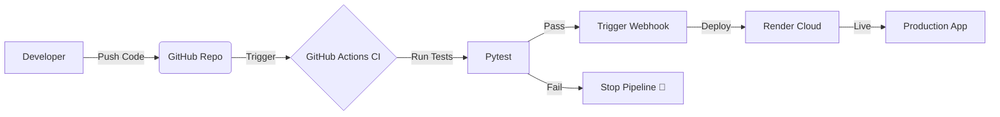

# 🚀 Zero-Cost CI/CD Pipeline Demo


## 📖 Overview
This project demonstrates a production-grade **Continuous Integration and Continuous Deployment (CI/CD)** pipeline built entirely with free tools.

The goal was to create a "GitOps" workflow where code changes are automatically tested and, upon passing, deployed to a live server without manual intervention.

**Live Demo:** https://zero-cost-pipeline.onrender.com/

---

## ⚙️ Architecture

The pipeline follows a strict logic: **"Code is only deployed if it passes tests."**



Source: Code is pushed to the main branch on GitHub.

CI (Integration): GitHub Actions spins up an Ubuntu container, installs dependencies, and runs unit tests (pytest).

CD (Deployment): If (and only if) tests pass, a secure Webhook triggers Render.

Production: Render pulls the latest code, builds the container, and updates the live website.

## 🛠️ Tech Stack
Application: Python (Flask)

Testing Framework: Pytest

CI Orchestrator: GitHub Actions

Cloud Hosting: Render (Free Tier)

WSGI Server: Gunicorn

## 📂 Project Structure

```
├── .github/workflows
│   └── pipeline.yml      # The CI/CD configuration
├── app.py                # The main Flask application
├── test_app.py           # Unit tests (CI checks this)
├── requirements.txt      # Python dependencies
└── README.md             # Documentation
```

## 🚀 How to Replicate This
Want to build this yourself? Follow these steps:

1. Setup Render (The Server)
Create a Web Service on Render.com.

Connect your GitHub repo.

Important: Turn off "Auto-Deploy" in Render settings.

Copy the Deploy Hook URL from the settings.

2. Setup GitHub Actions (The Automation)
Go to your GitHub Repo > Settings > Secrets > Actions.

Create a secret named RENDER_DEPLOY_HOOK_URL and paste the URL from step 1.

Add the .github/workflows/pipeline.yml file from this repository.

3. Deploy
Make a change to app.py.

Commit and push.

Watch the "Actions" tab in GitHub light up! 🟢

## 🧠 What I Learned
Building this pipeline reinforced the importance of:

Automated Testing: Catching bugs before they hit production.

Infrastructure as Code: Defining workflows in YAML rather than manual clicks.

Webhook Triggers: Connecting disparate systems (GitHub and Render) securely.

#3 🤝 Contributing
Feel free to fork this repo and add more complex tests to see how the pipeline handles failure!
